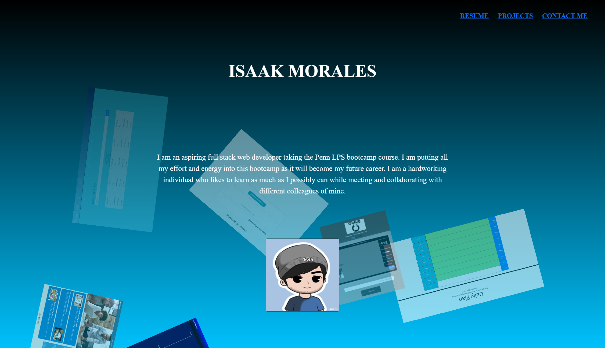

# Updated-Portfolio

## Description

My motivation for this project was to update my own portfolio using the knowledge I have in HTML and in CSS while using bootstrap. I built this project to see my progression and how far I've come from the last time I built my own portfolio.

## Installation

This is a user friendly portfolio, meaning that all you would really have to do is just load the page and click the links that will send you to the corresponding link or title.

## Usage

1-Load up the website
2-Click any of the links provided
3-The links will send you to the corresponding site/page of the website
4-Finally, if you are to scroll all the way down, my contact information is provided with easy clickable links

## Credits

gradient animated code by https://www.sliderrevolution.com/resources/css-animated-background/

www.bootstrap.com

## License

N/A

## Badges

N/A

## Features

N/A

## Deployed Link and GitHub Repo

https://callmeice.github.io/Updated-Portfolio/
https://github.com/CallMeIce